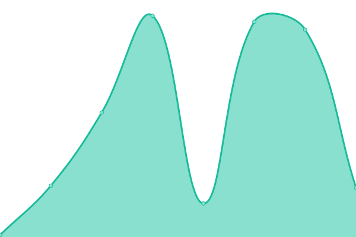

# [📈 Live Status](https://status.satoshienergy.com): <!--live status--> **🟩 All systems operational**

This repository contains the open-source uptime monitor and status page for [satoshi-energy-corp](https://status.satoshienergy.com), powered by [Upptime](https://github.com/upptime/upptime).

With [Upptime](https://upptime.js.org), you can get your own unlimited and free uptime monitor and status page, powered entirely by a GitHub repository. We use [Issues](https://github.com/satoshi-energy-corp/uptime/issues) as incident reports, [Actions](https://github.com/satoshi-energy-corp/uptime/actions) as uptime monitors, and [Pages](https://status.satoshienergy.com) for the status page.

<!--start: status pages-->
<!-- This summary is generated by Upptime (https://github.com/upptime/upptime) -->
<!-- Do not edit this manually, your changes will be overwritten -->
<!-- prettier-ignore -->
| URL | Status | History | Response Time | Uptime |
| --- | ------ | ------- | ------------- | ------ |
|  [Website (www)](https://www.satoshienergy.com) | 🟩 Up | [website-www.yml](https://github.com/satoshi-energy-corp/uptime/commits/HEAD/history/website-www.yml) | 

 250ms
     
 | 

<a href="https://status.satoshienergy.com/history/website-www">100.00%</a>
    

|  [Website (non-www)](https://satoshienergy.com) | 🟩 Up | [website-non-www.yml](https://github.com/satoshi-energy-corp/uptime/commits/HEAD/history/website-non-www.yml) | 

 301ms
     
 | 

<a href="https://status.satoshienergy.com/history/website-non-www">100.00%</a>
    

|  [Web App](https://app.satoshienergy.com) | 🟩 Up | [web-app.yml](https://github.com/satoshi-energy-corp/uptime/commits/HEAD/history/web-app.yml) | 

 169ms
     
 | 

<a href="https://status.satoshienergy.com/history/web-app">100.00%</a>
    

|  Hasura | 🟩 Up | [hasura.yml](https://github.com/satoshi-energy-corp/uptime/commits/HEAD/history/hasura.yml) | 

 532ms
     
 | 

<a href="https://status.satoshienergy.com/history/hasura">100.00%</a>
    

|  [Blog (Ghost)](https://research.satoshienergy.com) | 🟩 Up | [blog-ghost.yml](https://github.com/satoshi-energy-corp/uptime/commits/HEAD/history/blog-ghost.yml) | 

 534ms
     
 | 

<a href="https://status.satoshienergy.com/history/blog-ghost">100.00%</a>
    

<!--end: status pages-->

[**Visit our status website →**](https://status.satoshienergy.com)

## 📄 License

- Powered by: [Upptime](https://github.com/upptime/upptime)
- Code: [MIT](./LICENSE) © [satoshi-energy-corp](https://status.satoshienergy.com)
- Data in the `./history` directory: [Open Database License](https://opendatacommons.org/licenses/odbl/1-0/)
