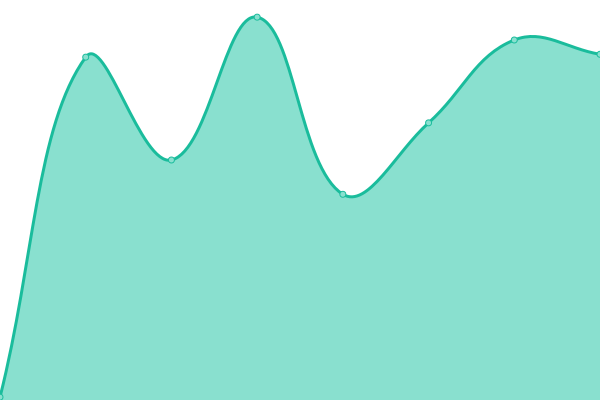
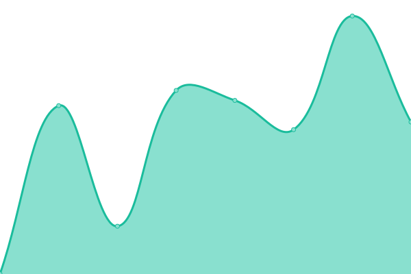

# [📈 Live Status](https://status.satoshienergy.com): <!--live status--> **🟧 Partial outage**

This repository contains the open-source uptime monitor and status page for [satoshi-energy-corp](https://status.satoshienergy.com), powered by [Upptime](https://github.com/upptime/upptime).

With [Upptime](https://upptime.js.org), you can get your own unlimited and free uptime monitor and status page, powered entirely by a GitHub repository. We use [Issues](https://github.com/satoshi-energy-corp/uptime/issues) as incident reports, [Actions](https://github.com/satoshi-energy-corp/uptime/actions) as uptime monitors, and [Pages](https://status.satoshienergy.com) for the status page.

<!--start: status pages-->
<!-- This summary is generated by Upptime (https://github.com/upptime/upptime) -->
<!-- Do not edit this manually, your changes will be overwritten -->
<!-- prettier-ignore -->
| URL | Status | History | Response Time | Uptime |
| --- | ------ | ------- | ------------- | ------ |
|  [Website (www)](https://www.satoshienergy.com) | 🟥 Down | [website-www.yml](https://github.com/satoshi-energy-corp/uptime/commits/HEAD/history/website-www.yml) | 

 317ms
     
 | 

<a href="https://status.satoshienergy.com/history/website-www">100.00%</a>
    

|  [Website (non-www)](https://satoshienergy.com) | 🟥 Down | [website-non-www.yml](https://github.com/satoshi-energy-corp/uptime/commits/HEAD/history/website-non-www.yml) | 

 86ms
     
 | 

<a href="https://status.satoshienergy.com/history/website-non-www">100.00%</a>
    

|  [Blog (Ghost)](https://research.satoshienergy.com) | 🟩 Up | [blog-ghost.yml](https://github.com/satoshi-energy-corp/uptime/commits/HEAD/history/blog-ghost.yml) | 

 647ms
     
 | 

<a href="https://status.satoshienergy.com/history/blog-ghost">100.00%</a>
    

|  [Platform/Front-end](https://app.satoshienergy.com) | 🟩 Up | [platform-front-end.yml](https://github.com/satoshi-energy-corp/uptime/commits/HEAD/history/platform-front-end.yml) | 

 111ms
     
 | 

<a href="https://status.satoshienergy.com/history/platform-front-end">100.00%</a>
    

|  Platform/Hasura | 🟩 Up | [platform-hasura.yml](https://github.com/satoshi-energy-corp/uptime/commits/HEAD/history/platform-hasura.yml) | 

 330ms
     
 | 

<a href="https://status.satoshienergy.com/history/platform-hasura">100.00%</a>
    

|  Stargazer/Hasura | 🟩 Up | [stargazer-hasura.yml](https://github.com/satoshi-energy-corp/uptime/commits/HEAD/history/stargazer-hasura.yml) | 

 640ms
     
 | 

<a href="https://status.satoshienergy.com/history/stargazer-hasura">100.00%</a>
    

|  Stargazer/Nodejs | 🟩 Up | [stargazer-nodejs.yml](https://github.com/satoshi-energy-corp/uptime/commits/HEAD/history/stargazer-nodejs.yml) | 

 112ms
     
 | 

<a href="https://status.satoshienergy.com/history/stargazer-nodejs">100.00%</a>
    

|  [ERCOT - SPP](https://www.ercot.com/misapp/GetReports.do?reportTypeId=12301) | 🟩 Up | [ercot-spp.yml](https://github.com/satoshi-energy-corp/uptime/commits/HEAD/history/ercot-spp.yml) | 

 1251ms
     
 | 

<a href="https://status.satoshienergy.com/history/ercot-spp">100.00%</a>
    

|  [ERCOT - Demand](https://www.ercot.com/api/1/services/read/dashboards/supply-demand.json) | 🟩 Up | [ercot-demand.yml](https://github.com/satoshi-energy-corp/uptime/commits/HEAD/history/ercot-demand.yml) | 

 13ms
     
 | 

<a href="https://status.satoshienergy.com/history/ercot-demand">100.00%</a>
    

|  [ERCOT - Indicative](https://www.ercot.com/content/cdr/html/rtd_ind_lmp_lz_hb_LZ_WEST.html) | 🟩 Up | [ercot-indicative.yml](https://github.com/satoshi-energy-corp/uptime/commits/HEAD/history/ercot-indicative.yml) | 

 105ms
     
 | 

<a href="https://status.satoshienergy.com/history/ercot-indicative">100.00%</a>
    

|  Noco | 🟩 Up | [noco.yml](https://github.com/satoshi-energy-corp/uptime/commits/HEAD/history/noco.yml) | 

 416ms
     
 | 

<a href="https://status.satoshienergy.com/history/noco">100.00%</a>
    

|  [Stargazer/CEM](https://cem.satoshienergy.com) | 🟩 Up | [stargazer-cem.yml](https://github.com/satoshi-energy-corp/uptime/commits/HEAD/history/stargazer-cem.yml) | 

 363ms
     
 | 

<a href="https://status.satoshienergy.com/history/stargazer-cem">100.00%</a>
    

<!--end: status pages-->

[**Visit our status website →**](https://status.satoshienergy.com)

## 📄 License

- Powered by: [Upptime](https://github.com/upptime/upptime)
- Code: [MIT](./LICENSE) © [satoshi-energy-corp](https://status.satoshienergy.com)
- Data in the `./history` directory: [Open Database License](https://opendatacommons.org/licenses/odbl/1-0/)
